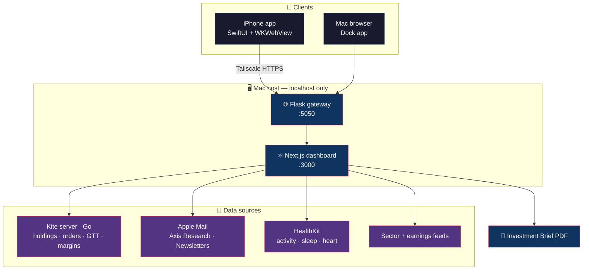

**Mechatronics engineer turned data & analytics builder — designing private, local-first systems for markets and everyday decisions.**

---

## 👤 Profile

| | |
|---|---|
| 🎓 **Education** | M.Sc. Computer-Aided Mechanical Engineering — **RWTH Aachen University** 🇩🇪 · B.Tech. Mechatronics — **UPES Dehradun** 🇮🇳 |
| 🏗️ **Experience** | Senior Mechanical Project Engineer — **Larsen & Toubro** (large-capex project execution) |
| 💼 **Currently** | Building at the intersection of **Data Analytics, Business Analytics, BI and Strategy** |
| 📈 **Domain** | Indian equity markets — an active retail investor who writes code to answer his own research questions |
| 🧭 **Open to** | Data / business analytics and strategy roles in India |

> 🔒 **One principle runs through everything here:** the data stays on the machine. No cloud, no third party sitting between me and my broker, my mail or my health data.

---

## 🔭 Flagship Project

### 📊 [Investment-Dashboard](https://github.com/aditya-narayana-sharma/Investment-Dashboard) &nbsp;·&nbsp; `TypeScript` &nbsp;·&nbsp; 🔥 actively developed

  

  

A **private, local-first portfolio intelligence platform for Indian equities** — a themeable dashboard running on a Mac, mirrored to a native iPhone app over a private Tailscale network. Live Zerodha Kite portfolio data sits alongside Axis Research briefs, a newsletter digest, macro scenarios and local podcast notes.

#### 🧭 Four persistent workspaces

| | |
|---|---|
| 💼 **Investment** | Action board, live Kite portfolio snapshot, macro scenario lab, analyst calls, portfolio and Axis risk views, recommendations |
| 🏭 **Sectoral Analytics** | S‑1 action board, S‑2 industry analytics, S‑3 benchmarks & decision lab — PESTEL, Porter's and macro triggers, each with its own scoped selector |
| 📰 **Market Intelligence** | M‑1 action board, M‑2 live intelligence (newsletters, Axis Research, podcasts), M‑3 earnings calendar, M‑4 calendar + reminders |
| 🩺 **Health & Wellness** | A private three-panel console — daily optimism and vital metrics across activity, sleep, heart, respiratory, mobility and nutrition, with an incognito gate on every tile |

#### ✨ Highlights

- 📈 **Live broker data** — holdings, positions, orders, GTTs and margins, auto-refreshed every five minutes, with failure-tolerant reads so one bad endpoint can't blank the portfolio
- 🚦 **Honest freshness** — when a source is unavailable the UI falls back to the last validated snapshot and labels it, rather than presenting stale data as live
- 🗂️ **Consistent action boards** — every workspace uses the same three-lane contract: `To Do Today` · `Monitor` · `Completed Today`, resetting at local midnight
- 🎨 **Theme switcher** — Black, Dark and Sepia, with viewport-fitted paged views so mobile never scrolls a console it shouldn't
- 🧾 **PDF reporting** — one-click export of the full Investment Brief
- 📱 **Native SwiftUI app** — persistent WKWebView, onboarding, source freshness indicators, offline recovery and HealthKit upload

#### 🏗️ Architecture

---

## 🧱 Other Projects

### 🔌 [kite-mcp-server](https://github.com/aditya-narayana-sharma/kite-mcp-server) &nbsp;·&nbsp; `Go` &nbsp;·&nbsp; fork of [zerodha/kite-mcp-server](https://github.com/zerodha/kite-mcp-server)

A self-hosted server layer over the **Zerodha Kite Connect** API, extended with six custom tools — `buy_stocks`, `sell_stocks`, `create_gtt`, `get_order_status`, `optimize_portfolio`, `rebalance_portfolio`. Order-placing calls require an explicit confirmation flag; portfolio tools stay strictly read-only, with every action written to an immutable audit log.

### ⏰ [ReminderWidget](https://github.com/aditya-narayana-sharma/ReminderWidget) &nbsp;·&nbsp; `Swift` &nbsp;·&nbsp; iOS 17+ / macOS 14+

A native **WidgetKit + AppIntents** widget surfacing Apple Reminders due in the next three hours — filterable by list and tag, with a URL-preview toggle, configurable straight from the widget gallery or Shortcuts.

### 🧬 [aditya-narayana-sharma](https://github.com/aditya-narayana-sharma/aditya-narayana-sharma) &nbsp;·&nbsp; profile

Config files for this profile — the README you're reading right now. 🙂

---

## 🍴 Forks I Build On & Learn From

| Repository | Language | Why it's here |
|---|---|---|
| 🤖 [ai-hedge-fund](https://github.com/aditya-narayana-sharma/ai-hedge-fund) | `Python` | Multi-agent investment research — reference architecture for market analysis |
| 📡 [modelcontextprotocol](https://github.com/aditya-narayana-sharma/modelcontextprotocol) | `TypeScript` | The MCP specification — how my tools expose data to LLM clients |
| 🧠 [openai-agents-python](https://github.com/aditya-narayana-sharma/openai-agents-python) | `Python` | Lightweight framework for multi-agent workflows |
| 🗺️ [INDIAN-SHAPEFILES](https://github.com/aditya-narayana-sharma/INDIAN-SHAPEFILES) | `Jupyter` | Shapefiles and GeoJSON for India — geospatial layers for analytics |
| ⌘ [Commander](https://github.com/aditya-narayana-sharma/Commander) | `Swift` | Lightweight macOS app launcher — SwiftUI / AppKit study material |
| 🎨 [VQGAN-CLIP](https://github.com/aditya-narayana-sharma/VQGAN-CLIP) | `Python` | Running VQGAN+CLIP locally instead of on Colab — an early local-first experiment |

---

## 🛠️ Technology Stack

 

| Layer | Tooling |
|---|---|
| 🐍 **Languages** | Python · TypeScript · Swift · Go · SQL |
| ⚛️ **Web & App** | Next.js · React · Flask · SwiftUI · WidgetKit · WKWebView |
| 📊 **Data & Analytics** | DuckDB · Parquet · Polars · TA-Lib · vectorbt / Backtrader · Jupyter |
| 💹 **Markets** | Zerodha Kite Connect · derivatives & open-interest analysis · sector and earnings analytics |
| 🧰 **Infrastructure** | Tailscale · Drizzle / D1 · HealthKit · Xcode · macOS automation |
| 🤖 **AI tooling** | Claude · Codex · Cursor · Copilot · Model Context Protocol |

---

## 📌 Currently Exploring

- 🧩 **Local data services** — markets, health, notes and files, all running on my own machine
- 🧮 **Systematic strategy research** — EMA crossover, RSI momentum, Bollinger and Supertrend frameworks, backtested before conviction
- 🛡️ **Safety-layered automation** — confirmation gates and immutable audit logs before anything touches a live order book
- 📉 **Decision surfaces** — collapsing research PDFs, mail and market data into one view worth acting on

---

## 📊 GitHub at a Glance

🏅 **Achievements** — 🦈 Pull Shark · 👥 Pair Extraordinaire · ⚡ Quickdraw · 🤠 YOLO

---

### 🤝 Let's Connect

Always happy to talk **markets, analytics and local-first data systems**.

Built in India 🇮🇳 — tracking Indian equities, one refresh at a time.

