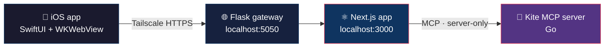

**Mechatronics engineer turned data & analytics builder — designing private, local-first systems for markets, agents and everyday decisions.**

---

## 👤 Profile

| | |
|---|---|
| 🎓 **Education** | M.Sc. Computer-Aided Mechanical Engineering — **RWTH Aachen University** 🇩🇪 · B.Tech. Mechatronics — **UPES Dehradun** 🇮🇳 |
| 🏗️ **Experience** | Senior Mechanical Project Engineer — **Larsen & Toubro** (large-capex project execution) |
| 💼 **Currently** | Building at the intersection of **Data Analytics, Business Analytics, BI and Strategy** |
| 📈 **Domain** | Indian equity markets — an active retail investor who writes code to answer his own research questions |
| 🧭 **Open to** | Data / business analytics and strategy roles in India |

> 🔒 **One principle runs through everything here:** the data stays on the machine. No cloud, no third party sitting between me and my broker, my mail or my health data.

---

## 🤖 AI-Native Toolchain

I don't just use AI tools — I **build the interfaces they run on**. Every project below is developed with agents in the loop and shipped with a written operating contract they must follow.

| 🧰 Tool | 🔧 How I use it |
|---|---|
| 🟣 **Claude** (Claude Code · Skills · MCP) | Primary development and research agent. I author **custom Skills** — market tracker, daily investment briefing, health coach, CV tailoring — and wire them to my own MCP servers |
| 🟢 **OpenAI Codex** | Agentic refactors and long-running build tasks, governed by the [`AGENTS.md`](https://github.com/aditya-narayana-sharma/Investment-Dashboard/blob/main/AGENTS.md) operating contract in my flagship repo |
| 🔵 **Cursor** | Fast in-editor iteration, multi-file edits and repo-wide context while prototyping |
| ⚫ **GitHub Copilot** | Inline completion and boilerplate across TypeScript, Python, Go and Swift |
| 🔌 **Model Context Protocol** | The connective tissue — I run **self-hosted MCP servers** for my broker, my filesystem and my git workflow, so agents act through audited tools rather than screen-scraping |

> 🧾 **Agent governance, not vibes.** [`AGENTS.md`](https://github.com/aditya-narayana-sharma/Investment-Dashboard/blob/main/AGENTS.md) defines a strict data-freshness and refresh contract: every source must independently report `live` or `verified`, failures are labelled `Stale` / `Cached` / `Unavailable` by name, and no agent may ever claim a dashboard is current when an audit row failed.
>
> 🛡️ **Human-in-the-loop by design.** Anything that can move money passes a single explicit confirmation gate, backed by an immutable audit log.

---

## 🔭 Flagship Project

### 📊 [Investment-Dashboard](https://github.com/aditya-narayana-sharma/Investment-Dashboard) &nbsp;·&nbsp; `TypeScript` &nbsp;·&nbsp; 🔥 actively developed

  

  

A **private, local-first portfolio intelligence platform for Indian equities**, served from a Mac and mirrored to a native iPhone app over Tailscale.

| | |
|---|---|
| 📈 **Live portfolio** | Zerodha Kite holdings, positions, orders, GTTs and margins through a server-only MCP session |
| 📰 **Research digest** | Axis Research briefs plus an Apple Mail newsletter digest, scoped to exact mailboxes with promos stripped |
| 🏭 **Sector & earnings** | Industry benchmarks, a PESTEL / Porter's decision lab, and an earnings calendar matched against holdings |
| 🩺 **Wellness workspace** | HealthKit-backed activity, sleep, heart, respiratory, mobility and nutrition with 7/30-day comparisons |
| 🧾 **Reporting** | One-click PDF export of the full Investment Brief |
| 📱 **Native app** | SwiftUI shell with persistent WKWebView, onboarding, offline recovery and HealthKit sync |

---

## 🧱 Other Work

<table>
<tr>
<td width="50%" valign="top">

### 🔌 [kite-mcp-server](https://github.com/aditya-narayana-sharma/kite-mcp-server)
`Go` · fork of [zerodha/kite-mcp-server](https://github.com/zerodha/kite-mcp-server)

A self-hosted MCP server that gives an LLM **safe hands on a brokerage account**, extended with six custom tools — `buy_stocks`, `sell_stocks`, `create_gtt`, `get_order_status`, `optimize_portfolio`, `rebalance_portfolio`.

⚠️ Order tools require one explicit confirmation; portfolio tools stay strictly read-only.

</td>
<td width="50%" valign="top">

### ⏰ [ReminderWidget](https://github.com/aditya-narayana-sharma/ReminderWidget)
`Swift` · iOS 17+ / macOS 14+

A native **WidgetKit + AppIntents** widget surfacing Apple Reminders due in the next three hours — filterable by list and tag, with a URL-preview toggle, configurable from the widget gallery or Shortcuts.

</td>
</tr>
</table>

---

## 🍴 Forks I Build On & Learn From

| Repository | Language | Why it's here |
|---|---|---|
| 🤖 [ai-hedge-fund](https://github.com/aditya-narayana-sharma/ai-hedge-fund) | `Python` | Multi-agent investment research — reference architecture for agentic market analysis |
| 📡 [modelcontextprotocol](https://github.com/aditya-narayana-sharma/modelcontextprotocol) | `TypeScript` | The MCP specification itself — the backbone of how my tools talk to LLMs |
| 🧠 [openai-agents-python](https://github.com/aditya-narayana-sharma/openai-agents-python) | `Python` | Lightweight framework for multi-agent workflows |
| 🗺️ [INDIAN-SHAPEFILES](https://github.com/aditya-narayana-sharma/INDIAN-SHAPEFILES) | `Jupyter` | Shapefiles and GeoJSON for India — geospatial layers for analytics |
| ⌘ [Commander](https://github.com/aditya-narayana-sharma/Commander) | `Swift` | Lightweight macOS app launcher — SwiftUI / AppKit study material |
| 🎨 [VQGAN-CLIP](https://github.com/aditya-narayana-sharma/VQGAN-CLIP) | `Python` | Running VQGAN+CLIP locally instead of on Colab — an early local-first experiment |

---

## 🛠️ Technology Stack

 

| Layer | Tooling |
|---|---|
| 🐍 **Languages** | Python · TypeScript · Swift · Go · SQL |
| ⚛️ **Web & App** | Next.js · React · Flask · SwiftUI · WidgetKit · WKWebView |
| 📊 **Data & Analytics** | DuckDB · Parquet · Polars · TA-Lib · vectorbt / Backtrader · Jupyter |
| 💹 **Markets** | Zerodha Kite Connect · derivatives & open-interest analysis · sector and earnings analytics |
| 🧰 **Infrastructure** | Tailscale · Drizzle / D1 · HealthKit · Xcode · macOS automation |

---

## 📌 Currently Exploring

- 🧩 **Purpose-built MCP servers** — markets, health, notes and files, all running locally
- 🧮 **Systematic strategy research** — EMA crossover, RSI momentum, Bollinger and Supertrend frameworks, with backtests before conviction
- 🛡️ **Safety-layered automation** — confirmation gates and immutable audit logs before anything touches a live order book
- 📉 **Decision surfaces** — collapsing research PDFs, mail and market data into one view worth acting on

---

## 📊 GitHub at a Glance

🏅 **Achievements** — Pull Shark · Pair Extraordinaire · Quickdraw · YOLO

---

### 🤝 Let's Connect

Always happy to talk **markets, MCP, agentic tooling and local-first data systems**.

Built in India 🇮🇳 — tracking Indian equities, one refresh at a time.

